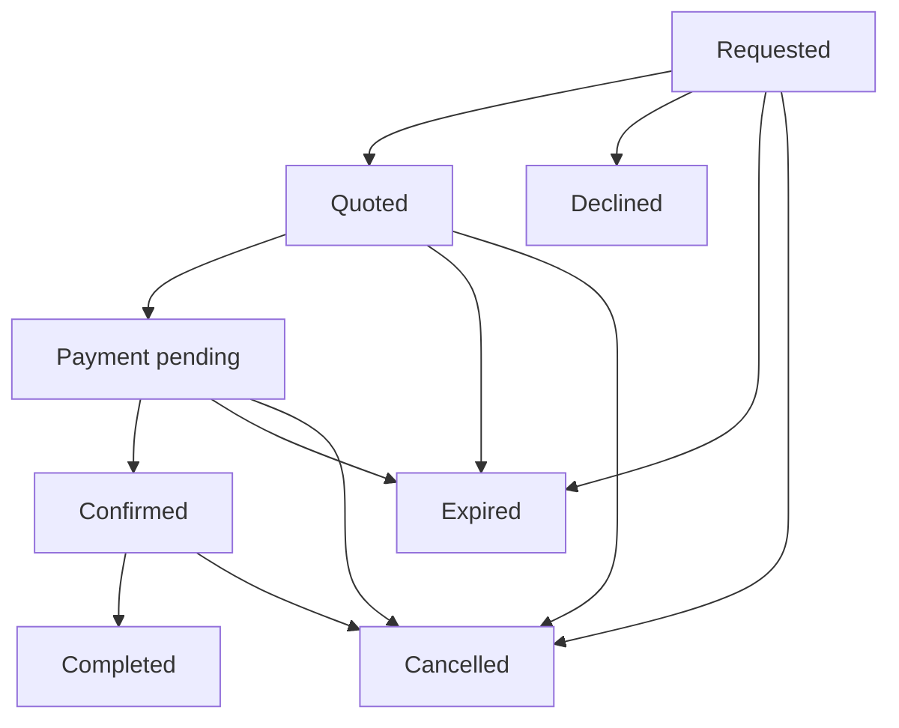
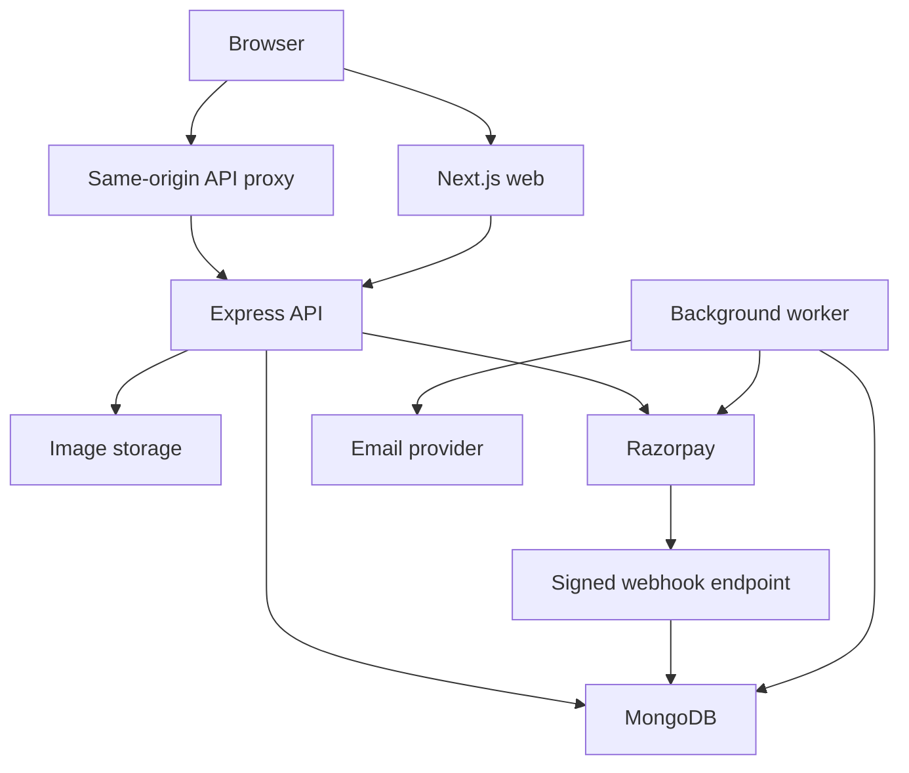
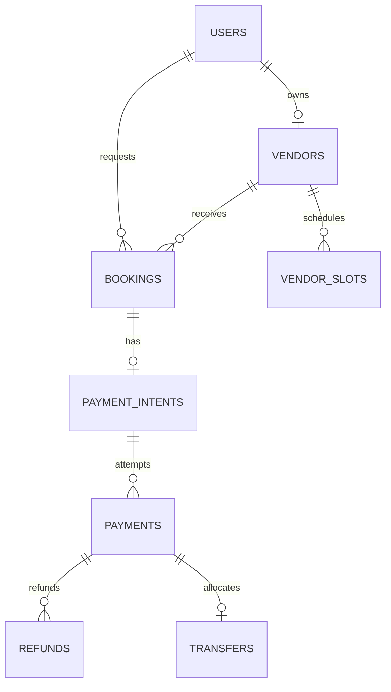

# Valoura MVP — Complete Implementation Planning Guide

Prepared for Rohit Singh · Version 1.0 · 11 September 2026

This guide contains all eight planning documents for a wedding vendor marketplace with online payments and booking management. The accompanying ZIP includes the same documents separately for your GitHub repository, a README, and visual wireframes.

**Baseline:** India/INR, Next.js and TypeScript frontend, Express and TypeScript backend, MongoDB, one vendor/date per booking, vendor quotation followed by full payment, cancellations and refunds. Sandbox implementation comes first; live vendor settlement has its own readiness requirements. These are proposed product decisions; no implementation is claimed complete.

**Contents**

1. Product requirements
2. User flows and acceptance criteria
3. Sitemap and UI wireframes
4. Architecture and stack
5. Database design
6. API specification
7. Development and Git/GitHub workflow
8. Implementation backlog and test plan

Start with document 01, then follow the backlog in document 08. Keep the separate Markdown versions in your repository and update them alongside code.

# 01 — Product Requirements Document

Version 1.0 · Owner: Rohit Singh · Baseline: 11 September 2026

## 1. Product purpose

Valoura is a wedding vendor marketplace. It helps a customer move from discovering a service provider to receiving a quote, making a payment and tracking the resulting booking. It gives vendors a manageable listing and booking workflow and gives an administrator tools to resolve operational problems.

The initial product is inspired by the wedding marketplace category. Use original branding, interface copy, sample records and images that you own or are permitted to use.

## 2. Users and their problems

| Role | Problem | MVP outcome |
| --- | --- | --- |
| Customer | Vendor details and booking progress are scattered | Search, quote, pay and track in one account |
| Vendor | Requests, available dates and payment information are hard to coordinate | One listing and a dated booking dashboard |
| Admin | Unapproved listings and money exceptions require intervention | Approval queue, booking lookup and refund/settlement records |

Accounts have one role: `customer`, `vendor` or `admin`. A vendor account owns exactly one business profile in the MVP. Public registration may request customer or vendor; it cannot assign admin. Admins are provisioned through a controlled server-side script. Role changes are outside normal self-service.

## 3. Scope and priorities

All rows labelled P0 are required for a complete MVP. P1 items can follow after the booking/payment journey works.

| ID | Capability | Priority | Included behaviour |
| --- | --- | --- | --- |
| FR-01 | Identity | P0 | Register, login, logout, current user, email verification, password reset, role/ownership enforcement |
| FR-02 | Vendor onboarding | P0 | Business name, one category, one service city, description, starting price, gallery, admin approval |
| FR-03 | Discovery | P0 | Home, category/city filters, starting-price range, price sort, pagination, approved profiles |
| FR-04 | Favourites | P1 | Save/remove vendors and view saved list |
| FR-05 | Booking request | P0 | Event date, city, guest count, requirements, vendor response |
| FR-06 | Quote | P0 | One fixed all-inclusive total, service scope, 24-hour validity; vendor can decline |
| FR-07 | Availability | P0 | Vendor day blocks and exclusive checkout/date reservation |
| FR-08 | Checkout | P0 | Customer accepts quote/policy; full INR payment through hosted provider checkout |
| FR-09 | Booking management | P0 | Customer/vendor lists and details, status timeline, cancellation and completion |
| FR-10 | Refunds | P0 | Policy calculation, admin execution, retry/reconciliation, customer-visible refund status |
| FR-11 | Administration | P0 | Listing approval, suspension, booking/payment search, money exception queue, audit trail |
| FR-12 | Notifications | P0 | Email verification/reset; booking, payment and refund email plus dashboard status |
| FR-13 | Vendor money tracking | P0 for live | Approved linked account reference, transfer and settlement tracking, refund reversals |

Launch with three manageable categories: photographers, makeup artists and decorators. Seed a few cities and at least 12 fictional vendors across the categories. The one-vendor-per-day capacity rule applies equally to all three categories.

## 4. Explicit scope limits

No multi-vendor cart, instant booking without quotation, instalments, subscriptions, coupons, reviews, live chat, guest list, wedding budget planner, AI recommendations, mobile app or multi-language support. No multi-day bookings, hourly slots, multiple vendor teams, negotiation thread or rescheduling. To change date, cancel and make a new request under the stated cancellation policy. Venue-specific capacity and packages are a later extension.

The booking request itself is the initial enquiry. A separate enquiry system would duplicate the same conversation in this version. A quote may be accepted or declined; changing it requires closing the old request and submitting a new one.

## 5. Canonical business rules

| Rule | Decision |
| --- | --- |
| BR-01 Date range | Customer selects tomorrow through 365 days from today in Asia/Kolkata. Each booking occupies that vendor's entire selected local calendar date. |
| BR-02 Discovery | Only approved listings owned by active vendors appear publicly or accept new requests. |
| BR-03 Request | At most one active request per customer/vendor/date; a request alone does not reserve availability. |
| BR-04 Response | Unanswered request expires 48 hours after submission, or at the event day's start, whichever occurs first. |
| BR-05 Quote | Vendor creates one quote per request; expires after 24 hours or at the event day's start, whichever occurs first. Quoting does not reserve the date. |
| BR-06 Price | Positive integer paise, currency INR; prototype range INR 100–500,000 inclusive. Starting price is an estimate; accepted quote is the payable total. |
| BR-07 Quote contents | Fixed description of inclusions, exclusions and all-inclusive total. No hidden checkout surcharge or separate tax calculator in MVP. |
| BR-08 Hold | Checkout atomically reserves a free date for 15 minutes, capped by quote expiry. No checkout if fewer than 60 seconds remain. |
| BR-09 Confirmation | Confirm only after verified captured payment for the exact order, amount and currency, while the booking owns an unexpired hold. Browser success alone never confirms it. |
| BR-10 Expiry | If the hold expires, the booking becomes `expired`. A new request is needed. An old checkout may still produce a late payment; it must be refunded, not revive the booking. |
| BR-11 Cancellation | Unpaid requests/quotes/holds may be cancelled. Paid customer cancellation uses BR-12; vendor cancellation refunds fully. Release the date atomically on cancellation. |
| BR-12 Customer refund | Full refund if cancellation local date is on or before eventDate minus 7 calendar days. Otherwise automatic entitlement is zero. Admin can grant a documented full goodwill refund. |
| BR-13 Technical refund | Late captured payment, duplicate charge, invalid booking ownership of slot or inability to fulfil causes full refund of that charge. |
| BR-14 Completion | Vendor or admin may mark a confirmed booking complete only after the event day's end in Asia/Kolkata. Completing does not manufacture payment or settlement success. |
| BR-15 History | Snapshot vendor name, service scope, price and policy at checkout. Later listing edits do not change an accepted booking. |
| BR-16 Suspension | Hide listing and block new requests/checkouts. Existing confirmed bookings remain visible; admin resolves them explicitly rather than deleting them. |

Example policy boundary: for an event on 20 December 2026, cancellation at any time on 13 December in Asia/Kolkata qualifies; cancellation on 14 December does not. Policy version `cancellation-v1` is stored with the accepted booking.

## 6. Money model

The customer pays 100% of the accepted quote once. A quote of INR 25,000 is stored as `2500000` paise. Valoura's launch commission is 0%; gateway charges and operating costs are borne by the project business under the eventual provider agreement. Do not subtract an invented provider fee from a vendor's promised amount.

The customer payment, vendor transfer and bank settlement are different events. For the live marketplace, use a provider-approved marketplace arrangement such as Razorpay Route with linked accounts; confirm product access and onboarding before activating live checkout. An ordinary gateway checkout integration alone is not vendor disbursement.

Proposed operations: after captured payment is allocated to a confirmed booking, create a vendor transfer using the approved provider flow. Track actual transfer and settlement status. Cancellation after transfer requires recovery/reversal and refund handling. The business needs enough refund liquidity; the UI must not promise an instant bank credit. Do not describe the platform as escrow.

Sandbox may use test linked accounts. If unavailable, build and test a labelled simulated transfer adapter while leaving live checkout disabled. Payment and booking features remain part of the MVP, not a future phase.

## 7. Quality targets

These are project targets to measure, not achieved results.

| Area | Acceptance target |
| --- | --- |
| Correctness | Concurrent checkout tests yield at most one confirmed booking per vendor/date. |
| Payments | Retried events and requests never double-allocate a payment or duplicate a refund intent. |
| Authorization | Customer/vendor cannot read or mutate another account's private resource by changing its ID. |
| Performance | At 10 concurrent test users and 1,000 vendor fixtures, vendor list p95 server response under 800 ms, excluding network and image delivery. |
| Usability | Core flows usable at 360 px width and with a keyboard; labelled fields and visible focus. |
| Reliability | Restarting API/worker does not lose persisted money operations; stale money states appear in admin queue. |
| Security | No card data, passwords, tokens or secrets in logs/repository; server validation and rate limits enabled. |
| Recovery | Restore a staging database backup and reconcile its pending payments before live launch. |

## 8. Definition of MVP success

A fictional customer finds an approved vendor, submits a request, receives a quote, pays in test mode, sees a confirmed booking, and later sees completion or cancellation/refund. Vendor and admin dashboards agree with the customer view. Automated tests cover failure and concurrency paths from document 08. The developer can demonstrate the feature's GitHub issue and pull request history.

Before commercial release, resolve provider eligibility, vendor agreement, refund policy wording, tax/invoice responsibilities, privacy/retention policy and support contact. These are launch decisions, not reasons to postpone sandbox implementation. This PRD's policy is a product proposal rather than legal or tax advice.


# 02 — User Flows and Acceptance Criteria

Version 1.0 · Governing business rules: document 01

## 1. State models

Booking and money have separate state machines. A cancelled booking can still have a captured payment awaiting refund. A confirmed booking can have a vendor transfer awaiting settlement.



| Booking state | Meaning | Allowed next states |
| --- | --- | --- |
| `requested` | Customer submitted requirements; no reservation | `quoted`, `declined`, `expired`, `cancelled` |
| `quoted` | Vendor supplied fixed terms; date still unreserved | `payment_pending`, `expired`, `cancelled` |
| `payment_pending` | Customer accepted terms and owns checkout hold | `confirmed`, `expired`, `cancelled` |
| `confirmed` | Captured payment allocated and date exclusively reserved | `completed`, `cancelled` |
| `declined` / `expired` / `cancelled` / `completed` | Terminal booking outcome | No normal transition; money repair can continue independently |

Payment attempts: `created`, `authorized`, `captured`, `failed`. A failure on one attempt does not fail another attempt for the same provider order. Do not downgrade a captured payment when an older failure arrives.

Refund intents: `queued`, `submitting`, `pending`, `processed`, `failed`, `needs_review`. Transfer records: `not_started`, `submitting`, `pending`, `processed`, `failed`, `reversed`, `needs_review`; store bank settlement separately as `pending`, `settled`, `failed`, `unknown`.

## 2. Customer journeys

### UF-01 — Register and return to the intended page

1. Customer opens a public vendor page and chooses Request quote.
2. If logged out, show login/register and remember an internal-only return path.
3. Register name, email and password; create customer role only from allowed input.
4. Send verification link, then require verified email before submitting a booking.
5. After login and verification, return to the vendor request form.

**AC-01:** Duplicate normalized email cannot create another account. Password is hashed. A payload requesting admin is rejected. Invalid credentials use a generic error. Logout invalidates the server session. Reset links are single-use and expire after 30 minutes; reset revokes existing sessions.

### UF-02 — Discover and shortlist

1. Choose city and category on the home page.
2. Results show business name, category, city, image and starting price.
3. Filter/sort; open a profile for gallery, service scope and request action.
4. Logged-in customer may save a favourite.

**AC-02:** URL retains filters across refresh/back navigation. Unapproved/suspended listings are absent. Starting-price filter does not claim to be a final quote. No matches shows a clear-filter action. Repeated save produces one favourite.

### UF-03 — Request a dated quote

1. Select date, confirm service city, guest count and requirements.
2. Backend checks role, verified email, published vendor and date range.
3. Backend rejects a currently blocked/reserved date; otherwise records request.
4. Customer sees `requested`, expiry time and “Your date is not reserved yet.”

**AC-03:** Same customer/vendor/date cannot have two active requests. Availability is checked again at checkout, even if it looked free when requested. Request expires at its stored deadline. Requirements must contain 20–2,000 characters; guest count is 1–5,000.

### UF-04 — Accept quote and pay

1. Customer reads vendor scope, all-inclusive total, date and cancellation terms.
2. Customer explicitly accepts the quote and versioned policy.
3. Backend reserves the vendor/date and creates a local payment intent in one transaction.
4. Backend creates a provider order; frontend opens hosted checkout using the returned order data.
5. UI shows payment pending while server verifies the result.
6. Verified captured payment with matching money/order and a valid held slot confirms the booking atomically.
7. Customer sees booking reference, payment reference, paid amount and timeline; notification is queued.

**AC-04:** Changing price in browser cannot change charged amount. Refresh/repeated click returns the same intent/order. Another customer sees a date conflict, not a second active checkout. Only the server's booking response controls the confirmation UI. No confirmed page appears for merely authorized payment.

### UF-05 — Recover from payment problems

| Situation | Required behaviour |
| --- | --- |
| Checkout closed without payment | Keep pending while hold remains; allow reopening same order. Explain expiry. |
| Payment attempt fails | Show failed attempt and allow another attempt on the same order while hold is valid. |
| Browser closes after successful payment | Webhook/worker can confirm; booking detail recovers on return. |
| Provider creation times out | Show “Checking payment setup”; reconcile before creating another order. |
| Hold expires | Mark booking expired and release slot; no further checkout creation on it. |
| Payment captured after expiry/cancellation | Record charge and queue a full refund; keep booking terminal. |
| Capture has wrong amount/currency/order | Do not confirm; flag exception and investigate/refund as appropriate. |
| Provider temporarily unavailable | Preserve durable state, show pending/retry status; do not assert payment failed. |

**AC-05:** A second captured charge cannot become a second allocation; it gets its own technical full-refund intent. Duplicate/out-of-order webhook handling causes no duplicate confirmation, notification or money operation.

### UF-06 — Cancel and track refund

1. Customer opens booking detail and views cancellation preview.
2. Preview shows refundable amount, applicable policy and reason.
3. Customer confirms cancellation with a reason and the current booking version.
4. Server recalculates policy using server time; atomically cancels, releases the slot and creates an entitled refund intent.
5. Admin processes queued refunds; UI distinguishes queued, provider pending, processed and needs review.

**AC-06:** A cancellation preview is not authority: a changed state or crossed policy boundary requires refreshed confirmation. At the 7-day boundary the PRD rule applies exactly. Refund amount cannot exceed the captured payment minus prior refunds. Vendor cancellation always creates full entitlement. Repeating cancellation does not create another refund. “Processed” reflects provider evidence, not just an API request being accepted.

## 3. Vendor journeys

### UF-07 — Publish a profile

Vendor registers, verifies email, fills required fields and uploads 1–12 images. The first submission changes listing from draft to pending. Admin approves or rejects with a reason. Rejection returns it to an editable state. Editing an approved profile creates an editable draft; submitting it sets its separate review status to pending while the old approved version remains public until replacement approval. Availability and booking operations are not public profile edits.

**AC-07:** Vendor can update only their profile. Public responses never expose email, payout identifiers or customer data. Images must be JPEG/PNG/WebP, at most 5 MB each; inspect actual file type, strip metadata and use owned storage IDs. Reject arbitrary remote fetch URLs. Published profile is a versioned snapshot.

### UF-08 — Quote or decline a request

Vendor opens their requests, reads date/requirements and sends one quote or a decline reason. Quote contains service description, inclusions, exclusions and a fixed all-inclusive INR amount. Server sets expiry. Customer gets a notification.

**AC-08:** Vendor cannot quote another vendor's request, quote after expiry, edit an already issued quote or confirm manually. Competing quotes for a date are allowed; first valid checkout gets the hold. Before quoting, warn if date is already blocked/held/confirmed and reject that quote submission.

### UF-09 — Manage availability and fulfilment

Vendor blocks/unblocks free future dates for external work. Held or confirmed dates cannot be overwritten. After a booked date ends, vendor marks the booking complete. Vendor can cancel their own future confirmed booking with a reason; this triggers full customer refund entitlement.

**AC-09:** Calendar exposes only available/unavailable publicly. Vendor completion before the end of the event date is rejected. Vendor cancellation after event start goes to admin resolution instead of ordinary self-service.

## 4. Admin journeys

### UF-10 — Operate the marketplace

Admin reviews submissions, suspends abusive accounts/listings, searches bookings by reference, looks up payment/refund records and processes entitled refunds. A recorded reason is mandatory for moderation, cancellation, goodwill refund and financial exception resolution.

**AC-10:** Admin cannot mark a payment captured, a refund processed or a bank settlement settled without provider evidence. Suspension blocks new activity but keeps history. Admin may resolve a past-date confirmed booking by cancellation with a documented refund decision; customer/vendor self-service ends at event start. Refund overrides are full-only in MVP.

## 5. Ownership matrix

| Operation | Customer | Vendor | Admin |
| --- | --- | --- | --- |
| Public approved listings | Read | Read | Read |
| Booking creation | Own customer account | No | No |
| Read booking | Own bookings | Their vendor's bookings | All |
| Quote/decline | No | Their requests | No |
| Checkout/payment verification | Own booking | No | No |
| Cancellation | Own, before event start | Own, before event start | Any eligible case with reason |
| Complete booking | No | Own, after event day | After event day |
| Process refund | No | No | Recorded entitlement/override only |
| Provider money state updates | No | No | Read/reconcile only; verified integration writes state |

Server middleware validates session and role; the service query also includes owner ID and expected state/version. Hiding a button is not authorization. Return 404 for inaccessible resource IDs to avoid exposing other users' records.


# 03 — Sitemap and UI Wireframes

Version 1.0 · Mobile-first functional layouts · Visual brand design follows this baseline

## 1. Navigation and pages

| Area | Route | Purpose and main action |
| --- | --- | --- |
| Public | `/` | City/category search; Explore vendors |
| Public | `/vendors` | Filtered, paginated vendor list; View profile |
| Public | `/vendors/[slug]` | Gallery, starting price and service information; Request quote |
| Identity | `/register`, `/login` | Account creation/access |
| Identity | `/verify-email`, `/forgot-password`, `/reset-password` | Verification and recovery |
| Customer | `/account` | Account overview and profile |
| Customer | `/account/favourites` | Saved vendors; Open profile |
| Customer | `/vendors/[slug]/request` | Dated requirements; Send request |
| Customer | `/account/bookings` | Filter own bookings; View details |
| Customer | `/account/bookings/[id]` | Quote, money, timeline and cancellation |
| Customer | `/account/bookings/[id]/checkout` | Quote acceptance and payment |
| Vendor | `/vendor` | Requests, upcoming bookings and attention items |
| Vendor | `/vendor/profile` | Edit profile, gallery and submit for review |
| Vendor | `/vendor/availability` | Date blocks and reservations |
| Vendor | `/vendor/bookings`, `/vendor/bookings/[id]` | Quote/decline, cancel, complete |
| Vendor | `/vendor/payments` | Collection, transfer and settlement overview |
| Admin | `/admin` | Queues and exception counts |
| Admin | `/admin/vendors`, `/admin/vendors/[id]` | Profile approval and rejection |
| Admin | `/admin/users` | Search and suspend/reactivate users |
| Admin | `/admin/bookings`, `/admin/bookings/[id]` | Booking lookup and resolution |
| Admin | `/admin/payments` | Payment and reconciliation queue |
| Admin | `/admin/refunds` | Queued/pending/failed refunds |
| Admin | `/admin/transfers` | Transfer/settlement/reversal tracking |
| Public | `/terms`, `/privacy`, `/cancellation-policy`, `/contact` | Published policies and support |

Account dropdown provides role-appropriate dashboard and logout. Do not display fake reviews, bookings or popularity counts. Use real seeded data labelled as demonstration data in test deployments.

## 2. Layout wireframes

Read each table from top to bottom as screen regions. Desktop columns are explicitly described; mobile stacks the same regions. A visual overview is included in `assets/wireframes.svg`.

### W-01 — Home

| Vertical region | Desktop arrangement | Mobile arrangement |
| --- | --- | --- |
| Header | Valoura left; Vendors, Login, Register right | Logo and accessible menu button |
| Hero | Heading “Find the right vendor for your wedding”; supporting sentence | Same heading, shorter line length |
| Search | City select + category select + Explore button on one row | Fields and full-width button stacked |
| Categories | Three equal category tiles | One/two columns depending on width |
| Vendors | Three cards per row, each with image/name/city/starting price | One card per row |
| Explanation | Find vendor, receive quote, pay and manage booking | Three short stacked steps |
| Footer | Contact, terms, privacy, cancellation policy | Stacked links |

### W-02 — Vendor results

| Region | Contents |
| --- | --- |
| Header | Shared navigation |
| Search summary | “Photographers in Jaipur”; result count |
| Left column, 25% | City, category, minimum/maximum starting price, clear filters |
| Right column, 75% | Sort control, result grid with two/three cards, pagination |
| Mobile | Filters button opens labelled dialog; one card per row; active filters remain visible |

Vendor card: image at fixed aspect ratio, business name link, city, category, “Starting from INR …”, favourite toggle and View profile. The full card need not be clickable; avoid nested interactive elements.

### W-03 — Vendor detail

| Region | Desktop arrangement | Mobile arrangement |
| --- | --- | --- |
| Identity | Breadcrumb, business name, category/city | Same sequence |
| Gallery | Large cover plus smaller thumbnails | Cover plus horizontal thumbnail list |
| Main body | Left 65%: about, services, inclusions guidance | Details after summary |
| Quote panel | Right 35%: starting price, selected date, Request quote, “Final price follows vendor quote” | Summary/action immediately after gallery |
| Availability | Date selection exposes unavailable dates without booking details | Same |

### W-04 — Request form

Vendor summary appears above event date, service city, guest count and requirements. Show a short privacy note explaining that requirements are shared with the selected vendor. Main action: Send request. Success navigates to booking detail in `requested` state; it does not show “Booking confirmed.”

### W-05 — Quote and checkout

| Region | Contents |
| --- | --- |
| Header | Booking reference and Back to booking |
| Left 60% | Vendor, event date, service scope, inclusions/exclusions |
| Right 40% | Quote total, “Full payment”, refund policy summary, expiry time |
| Acceptance | Required checkbox for displayed quote and cancellation policy version |
| Action | “Pay INR 25,000”; disabled while creating/recovering provider order |
| Active checkout | Hold countdown sourced from server deadline; reopen payment button |
| Outcome | Pending verification, confirmed, expired or failed attempt with appropriate next action |

On mobile, use one column and place total/policy directly before the payment button. Hosted checkout supplies sensitive payment entry; Valoura does not create its own card/UPI credential form. Do not use a countdown as the server's source of truth.

### W-06 — Booking detail

Top: booking reference, event date and status badge. Then vendor/customer context, accepted service scope, total and payment/refund summary. Next show chronological status events. Last show permitted actions. Cancellation opens a review dialog showing refundable amount and policy; confirmation submits the current version. For a refund exception, provide support reference and latest update time.

### W-07 — Vendor workspace

Desktop uses a left navigation rail and a main content column. Overview cards show pending requests, upcoming confirmed bookings and failed money operations. Bookings list shows date/customer/status/amount/action. Detail screen has requirements, quote form only when requested, and status-specific cancellation/completion actions. Availability page offers month navigation and separate blocked/held/confirmed markers. Mobile turns the navigation rail into a menu and rows into labelled cards.

### W-08 — Admin workspace

Top filters: reference, status, date range. Main table: booking/customer/vendor, booking state, collected amount, refund state and exception age. Detail drawer/page includes audit events and provider references. Buttons name the action precisely: Approve listing, Reject listing, Process refund, Reconcile. Require a reason where specified. Do not offer a generic “Set status” dropdown for money states.

## 3. Shared UI behaviour

| State | Required treatment |
| --- | --- |
| Loading | Stable skeleton or progress label; prevent duplicate submission |
| Empty | Explain absence and one useful next action |
| Validation failure | Field-level message tied to field; preserve entered values |
| Network failure | Explain retry; do not silently clear forms |
| Session expired | Login prompt with safe internal return route |
| Unauthorized | Appropriate access page; private data never flashes first |
| Date conflict | “This vendor is unavailable for that date”; return to date selection |
| Payment uncertain | “We are checking your payment”; refresh status, avoid urging a second payment |
| Refund pending | Amount and current stage, without guaranteed bank-credit time |
| Suspended listing | Unavailable publicly; existing booking remains accessible to its parties |

## 4. Components and accessibility

Create Button, Input, Select, Textarea, FormError, StatusBadge, VendorCard, FilterPanel, Gallery, DatePicker, QuoteSummary, BookingTimeline, MoneySummary, Pagination, ConfirmDialog, EmptyState and DashboardNavigation. Keep money/date formatting in shared utilities rather than duplicating it in screens.

Use semantic headings, actual buttons/links, visible labels, keyboard focus and descriptive image text. Dialogs trap focus and restore it when closed. Error text must not depend on colour. Aim for 44 px touch controls and readable 16 px body text. Format INR for display and always retain integer paise underneath. Display deadlines in Asia/Kolkata with timezone label where ambiguity matters.

## 5. Implementation sequence

Build shared layout and home page early, immediately after scaffold/CI. Use fictional vendor fixtures to build cards and results. Then connect discovery APIs. Add authentication and vendor/admin management next, followed by request/quote screens, checkout and booking dashboards. This sequence provides visible frontend progress before the more complex payment integration.


# 04 — Technical Architecture and Stack Decisions

Version 1.0 · Decisions are proposed for this MVP · References checked 11 September 2026

## 1. Selected architecture

Use a monorepo with a Next.js web application, an Express API and one background worker from the same backend codebase. A monorepo means one Git repository contains these related applications. The API is a modular monolith: separate feature modules within one deployable backend, avoiding distributed-service complexity for a solo project.



Browser requests use `/api/v1` on the same origin. A reverse proxy routes them to Express; it must preserve webhook raw bytes and cookie headers. Next.js server-rendered public pages can call an internal API address. Private booking/payment responses are never shared-cacheable.

## 2. Stack decision record

| Area | Choice | Reason / boundary |
| --- | --- | --- |
| Frontend | Next.js App Router + React + TypeScript | Public discovery pages plus interactive dashboards; explicit types help learning and refactoring. |
| Styling | Tailwind CSS with reusable components | Consistent spacing/layout; learn CSS layout fundamentals alongside utilities. |
| Backend | Node.js + Express + TypeScript | Clear API/service separation and transferable backend skills. |
| Database | MongoDB replica set + Mongoose | Fits vendor documents/gallery metadata; replica set supports transactional booking changes. |
| Validation | Zod request schemas | Treat browser data as untrusted; validate at API boundary. |
| Authentication | Server-side opaque sessions stored in MongoDB | Easy revocation/logout for a browser-only MVP. |
| Passwords | Argon2id through a maintained library | Salted password hashing, with parameters benchmarked during implementation. |
| Images | Cloudinary through backend-controlled uploads | Proposed managed image storage/transform adapter; verify account constraints at setup. |
| Customer payments | Razorpay Standard Checkout + Orders | Hosted payment UI, server-side verification and durable local records. |
| Vendor transfers | Razorpay Route adapter, subject to account enablement | Separate vendor onboarding and money movement. |
| Email | SMTP adapter; local mail catcher in development | Supports verification/reset and transactional notifications without provider coupling. |
| Background work | MongoDB jobs/outbox + one worker process | Durable expiration, webhook processing and reconciliation without Redis initially. |
| Tests | Vitest, Supertest, Playwright | Unit rules, real database/API integration and essential browser journeys. |
| Workflow | npm workspaces, ESLint, Prettier, GitHub Actions | One lockfile and reproducible checks. |
| Hosting topology | Web, API and worker processes; managed replica-set database | Hosting vendor can be selected later without changing application contracts. |

At setup, select a currently supported Node.js LTS compatible with the chosen Next.js release; record exact versions in `.nvmrc`, `package.json` and the lockfile. Do not hard-code this document's publication date as a version decision. Next.js officially supports TypeScript and App Router setup [S1].

If the existing backend uses JavaScript or JWT, inventory it first. Either bring it into this session contract with an explicit migration issue, or amend this architecture and API contract before implementation. Do not silently run two authentication schemes.

## 3. Module responsibilities

| Module | Owns |
| --- | --- |
| auth | Registration, password checks, sessions, verification/reset tokens |
| users | Account status and profile |
| vendors | Draft/approved profile versions, categories, cities, gallery |
| availability | Vendor/date slots, blocks and reservation ownership |
| bookings | Requests, quotes, policy snapshots, guarded state transitions |
| payments | Payment intents, provider orders, attempt records, verification and allocation |
| refunds | Refund entitlement, execution and reconciliation |
| transfers | Vendor-linked-account eligibility, transfers, reversals, settlements |
| admin | Protected operational queries and actions; delegates business changes to services |
| notifications | Transactional mail templates and outbox delivery |
| jobs | Leasing, retries, recovery and scheduler |

Controllers parse requests and call services. Services enforce role/ownership, rules and transitions. Models persist data. Provider adapters isolate external API calls. Never put booking rules only in React components or directly in route handlers.

## 4. Authentication and request protection

Use a cryptographically random session token; store only its hash with user ID and expiry. Production cookie: `HttpOnly`, `Secure`, `SameSite=Lax`, host-only and path `/`. Session idle limit: 24 hours; absolute limit: 7 days. Rotate at login and revoke on logout/password reset/suspension. Check expiry on each request; TTL cleanup is not authentication enforcement.

For browser mutations, require allowed Origin and a session-bound CSRF token, including a pre-login CSRF flow. `/auth/csrf` creates a short-lived pre-auth session if needed. Rotate both session and token after authentication. Webhooks are exempt from browser CSRF because they use provider signature authentication. Keep authorization checks in the backend. Cookie and session safeguards follow OWASP's guidance [S7]; timeout choices are project defaults.

Validate lengths, enums and identifiers; allowlist writable fields to prevent role/status mass assignment. Apply rate limits to login/reset, requests and payment creation. The first deployment uses one API replica with rate limiting; introduce a shared limiter before scaling replicas. Escape user text in the UI; do not render submitted HTML.

## 5. Money and concurrency design

Razorpay's checkout integration requires server-side signature verification and checking capture status [S2]. Its webhooks can be duplicated and are identified by event IDs [S3]. These provider facts inform the following Valoura-specific design.

1. **Begin checkout:** in a transaction, compare booking version/status and claim the unique vendor/date slot; set hold expiry and persist accepted quote/policy plus a payment intent and order-creation job.
2. **Create order:** outside that transaction, send server-stored paise and INR to the provider. Persist its order ID before presenting checkout. A known valid result can be returned synchronously; a timeout returns pending setup and is reconciled.
3. **Verify capture:** callback verification and webhook worker use one idempotent service. Fetch provider state where necessary. Check provider account/mode, order, currency and amount.
4. **Allocate:** in a transaction, compare current time with hold deadline, slot owner/state and booking state. Persist the captured attempt, set one allocated payment, confirm booking and slot, and queue notification/transfer work.
5. **Compensate:** captured charge without a valid allocation gets a technical refund intent. Do not reacquire a date or revive expired/cancelled bookings for a late event.

MongoDB conditional writes and unique indexes protect individual resources; transactions coordinate multiple documents [S4]. External provider calls cannot be part of a MongoDB transaction. Use durable intent/job records to recover the gap.

### Ambiguous external requests

A network timeout does not prove that an order, refund or transfer was not created. Mark the operation `needs_review` or reconciliation pending, query provider records and correlate stored references before retrying. Use a provider idempotency facility only where that specific endpoint documents one. Local request keys alone do not make external calls idempotent. After an unresolved timeout, prefer an admin exception over automatically making another charge/refund/transfer.

### Expiry and simultaneous actions

Worker runs each minute and expires requests, quotes and holds through conditional transactions. API writes also enforce deadline checks. For a stale hold encountered during another checkout, first run the same transactional expiry service, then attempt a fresh claim. A successful payment and expiry competing for the same records cannot both win. At exact hold expiry, treat the hold as expired. A lost race on confirmation therefore produces a full refund entitlement.

## 6. Webhooks and workers

Mount the Razorpay webhook handler with raw-body access before JSON parsing. Verify signature, then insert a durable event identified by provider plus event ID. Acknowledge only after durable acceptance; duplicates acknowledge without adding work. A worker leases unprocessed events, applies idempotent transitions and records outcome. Out-of-order events must not regress captured/processed states.

Use unique job keys and a lease expiration with owner token; a crashed worker's work becomes reclaimable. Every completion checks its lease token. Jobs: expire deadlines every minute; reconcile uncertain orders/payments/refunds/transfers every 5 minutes; send queued emails; flag operations still unresolved after 15 minutes to admin. Financial uncertainty stays visible until resolved; it is not deleted after retry exhaustion.

## 7. Vendor settlement boundary

Route supports transfers to linked accounts [S5]. Refunds of transferred payments can require reversing transfers [S6]. Implement a distinct adapter and collection for these operations; never infer vendor settlement from customer capture.

During live onboarding, an administrator records a provider-created linked account ID after verifying its association with the vendor and current readiness. The provider owns sensitive onboarding/bank details. New live checkout requires a ready vendor money account. A later transfer failure does not cancel the customer's already confirmed booking automatically; it becomes an operational exception. Freeze unsubmitted transfers on cancellation and reconcile in-flight ones before reversal/refund execution.

## 8. Operational baseline

Use structured logs with request ID, booking ID and redacted provider references; omit credentials, raw personal requirements and full webhook payloads. Track exception count/age, worker heartbeat, failed refunds and API errors. Offer public liveness and protected readiness checks. Back up the database; rehearse restore in staging. Keep test/live databases, credentials and webhook secrets separate.

Deploy schema/index changes compatibly before code depending on them. Rollback uses a previous application version; it must not overwrite financial history with an old backup. After incidents, reconcile provider state before reopening affected payment flows.

## 9. Official implementation references

These sources support platform mechanics. Valoura's policies, durations, scope and architecture choices are authored design decisions.

- [S1 — Next.js installation](https://nextjs.org/docs/app/getting-started/installation)
- [S2 — Razorpay Standard Checkout integration](https://razorpay.com/docs/payments/payment-gateway/web-integration/standard/integration-steps/)
- [S3 — Razorpay webhook validation and testing](https://razorpay.com/docs/webhooks/validate-test/)
- [S4 — MongoDB atomicity and transactions](https://www.mongodb.com/docs/manual/core/write-operations-atomicity/)
- [S5 — Razorpay Route](https://razorpay.com/docs/payments/route/)
- [S6 — Refund payments and reverse transfers](https://razorpay.com/docs/api/payments/route/refund-payments-and-reverse-transfer/)
- [S7 — OWASP session management](https://cheatsheetseries.owasp.org/cheatsheets/Session_Management_Cheat_Sheet.html)
- [S8 — GitHub flow](https://docs.github.com/en/get-started/using-github/github-flow)


# 05 — MongoDB Database Design

Version 1.0 · Canonical names for implementation · Use a replica set in development and tests

## 1. Conventions

All collections use `_id: ObjectId`, `createdAt` and `updatedAt` unless stated otherwise. API serializes `_id` as `id` string. References are ObjectIds. Money is integer paise with `currency: "INR"`. Instants are UTC dates; `eventDate` is a validated `YYYY-MM-DD` local date with `timeZone: "Asia/Kolkata"`. Calculate deadline instants with a timezone-aware library; do not parse a date-only string as local server time.

Use Mongoose schemas plus service validation and explicit database indexes. `unique: true` expresses an index requirement, not a sufficient request validator. Create indexes through versioned setup/migration scripts and check they actually exist before payment tests. Map duplicate-key conflicts to stable API errors.

## 2. Relationships



## 3. Identity and catalog collections

### `users`

| Field | Type / rule |
| --- | --- |
| name | Trimmed string, 2–100 characters |
| emailNormalized | Trimmed lowercase email, unique |
| passwordHash | Private string, excluded from ordinary projections |
| role | `customer`, `vendor`, `admin`; allowlisted registration roles |
| status | `active`, `suspended` |
| emailVerifiedAt | Date or null |
| sessionVersion | Integer starting at 1; increments to revoke sessions |

Indexes: unique `{emailNormalized:1}`; admin query `{role:1,status:1,createdAt:-1}`. Never expose password hash, token hashes or session metadata through user DTOs.

### `sessions` and `auth_tokens`

Sessions: `tokenHash` unique, `userId` nullable for pre-auth CSRF, `csrfTokenHash`, `sessionVersion`, `lastSeenAt`, `idleExpiresAt`, `absoluteExpiresAt`, `expiresAt` (earliest expiry). TTL index on `expiresAt` for cleanup, but requests independently reject expired sessions. Auth tokens: `tokenHash` unique, `userId`, `purpose` (`verify_email`, `reset_password`), `expiresAt`, `usedAt`. Consume using a conditional update. Verification tokens expire in 24 hours; reset tokens in 30 minutes.

### `categories` and `cities`

Both: `slug` unique, `name`, `active`. Categories seeded as `photographer`, `makeup-artist`, `decorator`. Cities seeded with canonical slugs such as `jaipur`, `delhi`, `lucknow`. Restrict changes to seed/migration scripts in MVP; no taxonomy editing UI. Validate references against active catalog items.

### `vendors`

| Field | Type / rule |
| --- | --- |
| ownerId | Unique reference to vendor-role user |
| slug | Unique immutable public slug |
| status | `draft`, `pending`, `approved`, `rejected`, `suspended` |
| draftProfile | Editable profile subdocument |
| publishedProfile | Last approved profile subdocument or null |
| draftVersion / publishedVersion | Integer version counters |
| submittedVersion | Version currently awaiting review, or null |
| moderation | Last actor, reason and time; history also in audit events |
| moneyAccount | Private provider, linkedAccountId, readiness `not_ready`/`ready`/`disabled`, checkedAt |

Profile fields: `businessName` (2–150), `categoryId`, `cityId`, `description` (50–5,000), `startingPricePaise` (positive bounded integer), `gallery` (1–12 objects of owned `assetId`, safe delivery URL, alt text and order). Drafts may be incomplete; submission validates the full profile. After first approval, editing sets draft differences while public reads keep the published version. Subsequent submission keeps existing published profile visible; moderation status for the submission is recorded separately as `reviewStatus: idle|pending|rejected`. Vendor `status` stays approved for an already published listing unless suspended. First submission uses status pending; first rejection uses rejected. This separation avoids hiding approved profiles during routine edits.

Indexes: unique owner/slug; public filter `{status:1,"publishedProfile.cityId":1,"publishedProfile.categoryId":1,"publishedProfile.startingPricePaise":1,_id:1}`. Public service also checks owner active status. Choose fixed filter queries; no arbitrary user-supplied Mongo expressions.

### `assets`

`ownerId`, provider asset ID unique, URL, MIME type, bytes, width, height, `status: pending|ready|deleted`, `attachedVendorId`. Validate actual bytes before ready. Asset deletion is allowed only if unreferenced by any draft or published profile. Keep original provider IDs server-controlled.

### `favourites`

`customerId`, `vendorId`; unique compound index on both. Lists project only publicly visible vendor data; show unavailable favourites safely without leaking private listing fields.

## 4. Booking and availability collections

### `bookings`

| Field | Type / rule |
| --- | --- |
| reference | Unique human-readable reference generated server-side |
| customerId / vendorId | Required references, immutable |
| eventDate / timeZone | Immutable date-only value and Asia/Kolkata |
| cityId / guestCount / requirements | Request details; immutable after submission |
| status | State enum in document 02 |
| isActive | True only for requested/quoted/payment_pending/confirmed |
| version | Integer; increment on every guarded transition |
| requestExpiresAt | Earlier of request+48h or event start |
| quote | Null or scope, inclusions, exclusions, amountPaise, currency, issuedAt, expiresAt, version=1 |
| acceptance | Null or quoteVersion, policyVersion, acceptedAt, vendorSnapshot, immutable quoteSnapshot |
| holdExpiresAt | Set once at checkout; null before |
| allocatedPaymentId | Null until verified capture allocated; retained after cancellation/refund |
| cancellation | Null or actorId, actorRole, reason, cancelledAt, refundablePaise, policyVersion |
| completedAt / completedBy | Null until completion |

Indexes: unique reference; `{customerId:1,createdAt:-1,_id:-1}`; `{vendorId:1,status:1,eventDate:1}`; deadline indexes on status/request expiry, status/quote expiry and status/hold expiry. Partial unique index `{customerId:1,vendorId:1,eventDate:1}` with filter `{isActive:true}` prevents duplicate active requests. Partial unique `{allocatedPaymentId:1}` for ObjectId-valued fields prevents reuse of the same charge.

Do not TTL-delete bookings. Terminal states set `isActive:false` in the same write. A completed historical record does not block future unrelated dates. New request validation prevents past-date rebooking.

### `vendor_slots`

One durable record per vendor/date: `vendorId`, `eventDate`, `state: free|blocked|held|confirmed`, `bookingId` nullable, `holdExpiresAt` nullable, `blockReason` private nullable, `version`. Unique index `{vendorId:1,eventDate:1}` is mandatory. Index `{state:1,holdExpiresAt:1}` supports expiry. A missing slot is available provisionally; checkout/block operation creates it and handles concurrent unique-index races.

Do not delete slots using TTL. A hold is expired by a transaction that also expires its owning booking; only that service may release a stale held slot. Block/unblock operates only on free/blocked states and never overwrites held/confirmed. Confirmed historical slots remain as a durable date allocation.

### Atomic operations

| Operation | Documents changed together |
| --- | --- |
| Checkout start | Booking quoted→payment_pending + free slot→held + payment intent + order job + audit event |
| Confirm capture | Payment record/allocation + booking→confirmed + held slot→confirmed + transfer/email jobs + audit |
| Hold expiry | Booking→expired, isActive=false + held slot→free + audit |
| Cancellation | Booking→cancelled, isActive=false + owned slot release + refund intent if due + transfer-freeze flag + audit/jobs |
| Vendor block | Conditional slot mutation + audit |

Every state mutation compares expected state/version and applicable deadline. On transaction retry, do not repeat external API calls. Concurrent duplicate-key creation is handled as a resource conflict or by re-reading and applying the same guarded service.

## 5. Money collections

### `payment_intents`

One per booking: `bookingId` unique, `amountPaise`, `currency`, `provider`, `mode: test|live`, `orderStatus: queued|creating|ready|needs_review|closed`, `providerOrderId` optional unique, `receipt` unique local reference, `closedAt`, `creationOperationId`. Provider fields are writeable only by the integration. The frozen amount comes from accepted quote, never request body. A closed intent still accepts recorded late charges for reconciliation/refund.

### `payments`

One per actual provider payment: `paymentIntentId`, `providerPaymentId` unique, `providerOrderId`, `amountPaise`, `currency`, `status: created|authorized|captured|failed`, `capturedAt`, `allocatedToBooking` boolean, `lastVerifiedAt`, `failureCode` sanitized. Keep failed attempts distinct from captured attempts. Monetary summaries derive from capture and processed refunds, not booking status.

### `refunds`

`paymentId`, `bookingId`, `reasonType: customer_policy|vendor_cancel|technical|goodwill`, `amountPaise`, `currency`, `status` enum from document 02, `entitlementKey` unique, `providerRefundId` optional unique, `requestedBy`, `approvedBy`, `reason`, `operationId`, `lastCheckedAt`, `failureCode`, `processedAt`.

MVP supports full remaining refunds only; no arbitrary partial refund entry. Entitlement keys distinguish a booking cancellation refund from refunds for separate duplicate charges. Reserve refundable balance against queued/submitting/pending/needs_review and processed refunds atomically; a failed operation retains entitlement and is retried/reconciled as the same intent, not a new one. Never issue cumulative refunds beyond captured amount. Read provider refund state for out-of-band dashboard activity before execution.

### `transfers`

`paymentId` unique, `vendorId`, `linkedAccountId`, `amountPaise`, `currency`, `status`, `providerTransferId` optional unique, `settlementStatus`, `providerSettlementId` optional, `reversedPaise`, `freezeRequested`, `operationId`, `lastCheckedAt`, `failureCode`.

A transfer exists only for the allocated charge of a confirmed booking. Record provider-reported actual transfer/settlement data. On cancellation: stop queued transfer; reconcile one already submitting; reverse processed transfer as required before/refunding through the configured provider flow. Refunding the customer does not imply a transfer has been reversed unless verified. Keep this as an exception if unresolved.

For optional provider ID fields, use partial unique indexes that include only string-valued IDs, avoiding multiple-null unique-index collisions.

## 6. Reliability collections

| Collection | Required fields and indexes |
| --- | --- |
| `webhook_events` | provider, eventId, eventType, receivedAt, minimal verified payload, processedAt, status, failureCode; unique provider+eventId |
| `jobs` | type, unique jobKey, payload refs, status, runAt, attempts, leaseOwner, leaseUntil, lastError; status+runAt and leaseUntil indexes |
| `idempotency_requests` | actorId, operation, key, requestHash, status, resourceId, safe response, expiresAt; unique actorId+operation+key |
| `audit_events` | actorId/system, action, resourceType, resourceId, old/new state, reason, requestId, time; resourceType+resourceId+time index |

Use 24-hour cleanup for completed generic idempotency entries. Permanent business uniqueness (one intent per booking, one entitlement key, unique provider IDs) protects money even after that window. Audit history has no public mutation API. Limit stored webhook data to what processing needs; redact personal fields and establish retention before launch.

## 7. Example accepted booking

```json
{
  "id": "<booking-object-id>",
  "reference": "VAL-2026-000123",
  "customerId": "<customer-object-id>",
  "vendorId": "<vendor-object-id>",
  "eventDate": "2026-12-20",
  "timeZone": "Asia/Kolkata",
  "status": "payment_pending",
  "isActive": true,
  "version": 3,
  "quote": {
    "version": 1,
    "scope": "One photographer for an eight-hour wedding event",
    "inclusions": "Edited digital album; local travel",
    "exclusions": "Printed album; out-of-city travel",
    "amountPaise": 2500000,
    "currency": "INR",
    "issuedAt": "2026-09-11T12:00:00.000Z",
    "expiresAt": "2026-09-12T12:00:00.000Z"
  },
  "acceptance": {
    "quoteVersion": 1,
    "policyVersion": "cancellation-v1",
    "acceptedAt": "2026-09-11T12:10:00.000Z",
    "vendorSnapshot": {"businessName": "Example Wedding Studio"},
    "quoteSnapshot": {"amountPaise": 2500000, "currency": "INR", "scope": "One photographer for an eight-hour wedding event", "inclusions": "Edited digital album; local travel", "exclusions": "Printed album; out-of-city travel"}
  },
  "holdExpiresAt": "2026-09-11T12:25:00.000Z",
  "allocatedPaymentId": null
}
```

Object ID placeholders must be replaced in seed code. This is illustrative data, not an insert-ready production record.

## 8. Data lifecycle

Suspend/archive instead of deleting money-linked users/vendors. A later erasure process should anonymize eligible personal fields while retaining records required by the adopted commercial/legal retention policy. Never store card numbers, CVV, UPI PINs or vendor bank credentials. No real personal data in fixtures or screenshots.

Seed accounts use generated local credentials outside Git. Seed at least one pending vendor, one rejected vendor, one unavailable date and examples of each booking/money state. Use separate test and development databases. Database migration history records applied version and time; every migration affecting money is reviewed for reversibility before running.


# 06 — API Specification

Version 1.0 · REST base `/api/v1` · JSON unless stated · This is the implementation contract, not a deployed API

## 1. Shared conventions

Authentication uses the session cookie from document 04. Browser mutations require `X-CSRF-Token`; same-origin credentials are sent automatically or explicitly with the fetch client. Provider webhooks use their signature instead. IDs are ObjectId strings except public slugs and booking references. Times are ISO 8601 UTC; eventDate is local date-only. Paise are integers.

List query defaults: `page=1`, `limit=12`; max limit 50; deterministic secondary sort by ID. Admin lists default limit 25. Invalid page/limit/filter returns 422. Lists return `data` array plus `meta: {page,limit,total,totalPages}`. Resource responses return `{data: ...}`. DELETE/logout returns 204 without body. Creation returns 201; normal read/update returns 200; accepted background work returns 202.

```json
{
  "error": {
    "code": "DATE_UNAVAILABLE",
    "message": "This vendor is unavailable for the selected date.",
    "fields": {},
    "requestId": "req_example"
  }
}
```

Use 400 malformed JSON, 401 unauthenticated, 403 role/CSRF failure, 404 missing or inaccessible resource, 409 state/version/availability/idempotency conflict, 422 validation, 429 rate limit, 502 definite upstream rejection and 503 temporary service unavailability. An ambiguous provider outcome normally returns 202 with a polling resource, not an invented failure.

Require `Idempotency-Key` UUID on booking creation, checkout, cancellation and admin refund execution/goodwill/transfer execution. Store actor+operation+key and a canonical request hash. Same key/body returns original resource/result; same key/different body returns 409 `IDEMPOTENCY_CONFLICT`; work still running returns 202. Versioned booking mutations use `expectedVersion` in body; stale version returns 409 `STALE_VERSION` with safe current version. Non-owner lookup returns 404.

## 2. Identity

| Method / endpoint | Access | Request | Success |
| --- | --- | --- | --- |
| GET `/auth/csrf` | Public/session | None | 200 `{csrfToken}`; pre-auth cookie if needed |
| POST `/auth/register` | Public + CSRF | `{name,email,password,role}`; role customer/vendor | 201 `{user,verificationRequired:true}` |
| POST `/auth/login` | Public + CSRF | `{email,password}` | 200 `{user,csrfToken}` + rotated session cookie |
| POST `/auth/logout` | Session + CSRF | Empty | 204; revoke and clear cookie |
| GET `/auth/me` | Session | None | 200 `{user}` |
| POST `/auth/verification-email` | Session | Empty | 202 `{message}`; rate limited |
| POST `/auth/verify-email` | Public + CSRF | `{token}` | 200 `{verified:true}` |
| POST `/auth/forgot-password` | Public + CSRF | `{email}` | 202 generic `{message}` regardless of existence |
| POST `/auth/reset-password` | Public + CSRF | `{token,newPassword}` | 200 `{message}`; revoke sessions |
| PATCH `/users/me` | Session | `{name}` only | 200 `{user}` |

User DTO: `{id,name,email,role,status,emailVerified}`. Password policy: 12–128 characters, allow spaces; never truncate. Verification/reset tokens are single-use. Registration creates a session but verified email is required for requests, vendor submission and checkout. Reject writable fields outside the allowlist.

## 3. Catalog and vendor profile

| Method / endpoint | Access | Request/query | Success |
| --- | --- | --- | --- |
| GET `/categories` | Public | None | Active `{id,slug,name}` list |
| GET `/cities` | Public | None | Active `{id,slug,name}` list |
| GET `/vendors` | Public | `city`, `category` slugs; `minPricePaise`, `maxPricePaise`; `sort=price_asc|price_desc|newest`; page/limit | Paged VendorCard list |
| GET `/vendors/:slug` | Public | Slug | Published VendorDetail; 404 if hidden |
| GET `/vendors/:id/availability` | Public | `from`, `to` date-only, max 31-day span | `{vendorId,from,to,unavailableDates:[...]}`; no private owners/reasons |
| GET `/vendor/profile` | Vendor | None | Own profile, review state and money readiness |
| PATCH `/vendor/profile` | Vendor | Draft fields + `expectedDraftVersion` | Updated draft; create one on first edit |
| POST `/vendor/profile/submit` | Verified vendor | `{expectedDraftVersion}` | `{reviewStatus,submittedVersion}` |
| POST `/assets` | Verified vendor | Multipart `file`, max 5 MB | 201 `{id,url,mimeType,width,height}` after validation |
| DELETE `/assets/:id` | Asset owner | None | 204 if unreferenced; otherwise 409 |
| PUT `/vendor/availability/:date` | Vendor | `{blocked:true,reason}` or `{blocked:false}` | `{date,state}`; 409 if held/confirmed |

VendorCard: `{id,slug,businessName,category:{id,slug,name},city:{id,slug,name},startingPricePaise,currency,coverImage}`. VendorDetail adds description and gallery. Neither exposes owner email, moderation notes or linked account ID. Asset upload uses server credentials; client never sets provider IDs.

Draft payload: `{businessName,categoryId,cityId,description,startingPricePaise,gallery:[{assetId,alt,order}],expectedDraftVersion}`; all optional while drafting except version. Backend resolves safe delivery URLs from owned assets. Submission requires complete valid fields. No public free-text search in MVP; category/city/price filtering is the defined discovery contract.

## 4. Favourites

| Method / endpoint | Access | Request | Success |
| --- | --- | --- | --- |
| GET `/favourites` | Customer | page/limit | Paged vendor cards |
| PUT `/favourites/:vendorId` | Customer | Empty | 200 `{saved:true}`; duplicate is harmless |
| DELETE `/favourites/:vendorId` | Customer | Empty | 204, including already removed |

## 5. Booking requests, quotes and management

| Method / endpoint | Access | Request/query | Success |
| --- | --- | --- | --- |
| POST `/bookings` | Verified customer | BookingRequest + idempotency key | 201 BookingDetail in requested state |
| GET `/bookings` | Customer/vendor | status, page/limit | Own bookings only, paged BookingSummary |
| GET `/bookings/:id` | Booking party/admin | None | BookingDetail with role-appropriate private data |
| POST `/bookings/:id/quote` | Owning vendor | QuoteRequest + expectedVersion | Updated BookingDetail |
| POST `/bookings/:id/decline` | Owning vendor | `{reason,expectedVersion}` | Declined BookingDetail |
| GET `/bookings/:id/cancellation-preview` | Booking party/admin | None | `{bookingVersion,refundablePaise,currency,policyVersion,reason,eligible,calculatedAt}` |
| POST `/bookings/:id/cancel` | Eligible party/admin | `{reason,expectedVersion,acceptedRefundablePaise}` + idempotency key | Cancelled BookingDetail, refund summary if due |
| POST `/bookings/:id/complete` | Owning vendor/admin | `{expectedVersion}` | Completed BookingDetail |

```json
{
  "vendorId": "<vendor-object-id>",
  "eventDate": "2026-12-20",
  "cityId": "<jaipur-object-id>",
  "guestCount": 200,
  "requirements": "Wedding photography for an eight-hour event in Jaipur."
}
```

BookingRequest above must match the vendor's service city. QuoteRequest:

```json
{
  "scope": "One photographer for eight hours",
  "inclusions": "Edited digital album and local travel",
  "exclusions": "Printed album and travel outside Jaipur",
  "amountPaise": 2500000,
  "currency": "INR",
  "expectedVersion": 1
}
```

Scope length 20–2,000; inclusions/exclusions each 0–2,000; reason 10–500. Backend supplies quote expiry/version, never accepts client values for those fields. A re-quote on quoted state returns 409. Request/quote date/state deadlines are evaluated at write time.

BookingSummary: `{id,reference,status,version,eventDate,vendorName,customerName,amountPaise,currency,createdAt}` with customer name omitted from unrelated projections. BookingDetail adds request, quote, acceptance, deadlines, allowedActions, payment/refund summary and sanitized timeline. Vendor sees customer name/contact only for that vendor's own request/booking, never an account password/token.

`allowedActions` is a UI convenience; server still authorizes every action. Cancellation recalculates entitlement and compares with `acceptedRefundablePaise`. If it changed after preview, return 409 `REFUND_PREVIEW_CHANGED`; do not silently apply a less favourable policy.

## 6. Checkout and verification

### POST `/bookings/:id/checkout`

Access: verified owning customer. Require idempotency key.

```json
{
  "quoteVersion": 1,
  "policyVersion": "cancellation-v1",
  "acceptTerms": true,
  "expectedVersion": 2
}
```

No amount is accepted. Server checks published/active vendor, valid quote, date and live vendor money readiness if in live mode. Atomically claim hold and persist intent, then create order outside transaction. Reply 201 for newly ready checkout, 200 for replay/ready existing resource, or 202 while order creation is uncertain:

```json
{
  "data": {
    "bookingId": "<booking-object-id>",
    "paymentIntentId": "<intent-object-id>",
    "status": "ready",
    "provider": "razorpay",
    "mode": "test",
    "keyId": "<public-test-key-id>",
    "providerOrderId": "<provider-order-id>",
    "amountPaise": 2500000,
    "currency": "INR",
    "holdExpiresAt": "2026-09-11T12:25:00.000Z"
  }
}
```

Pending setup response contains booking/intent IDs, `status: "creating"` or `"needs_review"`, hold deadline and `pollUrl`; omit checkout key/order until ready. Different keys for the same booking still converge on its one intent. Reopening an existing valid hold does not extend it or require a new quote.

### GET `/bookings/:id/checkout`

Owning customer only. Returns existing ready/pending checkout resource without creating a hold; expired intent returns 409 `CHECKOUT_EXPIRED`. UI polls at 2-second intervals for at most 30 seconds, then offers manual refresh and support reference. Backend continues recovery after the browser stops polling.

### POST `/payments/verify`

Owning customer; CSRF required. Body: `{bookingId,razorpay_order_id,razorpay_payment_id,razorpay_signature}`. Retrieve the stored order ID before signature calculation, verify provider payment ownership and fetch capture evidence. Do not trust the body order ID as authority. Use the same capture service as webhook processing. Return `{bookingStatus,paymentStatus,refundStatus}` with 200 when resolved or 202 when pending. Invalid signature is 400 `PAYMENT_VERIFICATION_FAILED`; never fulfil from it.

### GET `/bookings/:id/payments`

Booking party/admin. Returns `{payments:[{id,status,amountPaise,currency,capturedAt}],refunds:[{id,status,amountPaise,updatedAt}],totalCapturedPaise,totalRefundedPaise,netPaidPaise}`. Show sanitized provider references only where needed for customer receipt/support. Vendor settlement details belong to vendor/admin views.

### POST `/webhooks/razorpay`

Provider-authenticated raw-body route. Validate `X-Razorpay-Signature`; deduplicate using `X-Razorpay-Event-Id`. Persist validated event before acknowledging 200 `{received:true}`. Invalid signature returns 400; persistence outage returns 503 to permit retry. Subscribe to the supported capture/order, failure, refund and Route transfer/settlement events needed by adapters; map exact enabled event names against provider docs/account during integration.

## 7. Administration and vendor money

All admin endpoints require admin session, CSRF on mutations, reason where specified and audit recording.

| Method / endpoint | Request/query | Success |
| --- | --- | --- |
| GET `/admin/vendors` | status/reviewStatus, page/limit | Paged moderation summaries |
| GET `/admin/vendors/:id` | None | Draft and published versions, review and money metadata |
| POST `/admin/vendors/:id/review` | `{decision:approve|reject,submittedVersion,reason}` | Updated moderation state |
| PATCH `/admin/vendors/:id/status` | `{status:approved|suspended,reason}` | Suspend or restore previously approved listing; cannot bypass initial review |
| GET `/admin/users` | role/status/email, page/limit | Paged sanitized users |
| PATCH `/admin/users/:id/status` | `{status:active|suspended,reason}` | Updated user; no self-suspension of sole admin |
| GET `/admin/bookings` | reference/status/from/to, page/limit | Paged booking summaries |
| GET `/admin/payments` | providerPaymentId/bookingReference/status, page/limit | Paged payments with exceptions |
| POST `/admin/payments/:id/reconcile` | `{reason}` | 202 `{jobId,status:queued}`; repeat reuses active job |
| GET `/admin/refunds` | status, page/limit | Paged refund intents |
| POST `/admin/refunds/:id/execute` | `{reason}` + idempotency key | 202 `{refundId,status}` |
| POST `/admin/bookings/:id/goodwill-refund` | `{reason}` + idempotency key | 201/200 existing or new full remaining refund entitlement |
| PUT `/admin/vendors/:id/money-account` | `{linkedAccountId,reason}` | Verified provider association/readiness; not arbitrary client readiness |
| GET `/admin/transfers` | status/settlementStatus, page/limit | Paged transfers and exceptions |
| POST `/admin/transfers/:id/reconcile` | `{reason}` | 202 `{jobId,status:queued}` |
| POST `/admin/transfers/:id/execute` | `{reason}` + idempotency key | 202 existing/new job; only eligible unsent transfer |
| GET `/vendor/payments` | page/limit | Own allocated collections, transfers and settlement state |

Admin booking detail uses shared GET `/bookings/:id`. Admin cancellation/completion uses shared guarded endpoints. No arbitrary endpoint sets payment/refund/settlement state. Goodwill endpoint applies only to cancelled/completed bookings with a captured charge and remaining refundable balance. If transfer recovery is required, execution routes through the provider adapter and preserves uncertainty rather than duplicating a refund.

## 8. Contract implementation and validation

Create shared DTO types and Zod request schemas from this contract; server persistence models remain private. Add OpenAPI generation or an `openapi.yaml` during V-03 so Swagger/Postman tooling can use the same operations. This document is the current human-readable contract, not a claim that an OpenAPI file already exists.

Contract examples are representative request/response shapes; provider IDs and dates in fixtures must be generated at test time. Before each feature merges, check that its route, body, role, error codes and DTO match this document and add any deliberate change in the same pull request.

## 9. Important domain errors

| Code | HTTP | Trigger |
| --- | --- | --- |
| `EMAIL_NOT_VERIFIED` | 403 | Verified identity required |
| `DATE_UNAVAILABLE` | 409 | Blocked/held/confirmed slot |
| `DUPLICATE_ACTIVE_REQUEST` | 409 | Same customer/vendor/date active request |
| `REQUEST_EXPIRED` / `QUOTE_EXPIRED` | 409 | Server deadline passed |
| `STALE_VERSION` | 409 | Mutation uses old booking/profile version |
| `CHECKOUT_EXPIRED` | 409 | Hold no longer valid |
| `VENDOR_PAYMENTS_NOT_READY` | 409 | Live vendor onboarding not ready |
| `REFUND_PREVIEW_CHANGED` | 409 | Cancellation entitlement changed |
| `INVALID_STATE_TRANSITION` | 409 | Action does not apply to current state |
| `IDEMPOTENCY_CONFLICT` | 409 | Key reused with different body |
| `PAYMENT_VERIFICATION_FAILED` | 400 | Invalid signature/order relationship |
| `UPSTREAM_PENDING` | 202 | External result is being reconciled; response is data, not error |


# 07 — Development, Git and GitHub Workflow

Version 1.0 · Designed for a solo developer practising a team process

## 1. Working model

Use GitHub flow: a stable `main`, short-lived branches, pull requests, checks and merges. GitHub documents this branch-and-review workflow [official guide](https://docs.github.com/en/get-started/using-github/github-flow). For Valoura, use one issue per small deliverable and squash merge once its acceptance conditions pass. A permanent `develop` branch is unnecessary for this initial project.

Act in sequence as product owner (choose acceptance criteria), developer (implement), tester (verify behaviour) and reviewer (inspect the diff). Self-review is useful practice, but do not claim it is independent review or try to approve your own PR as another person.

## 2. Target repository structure

| Path | Responsibility |
| --- | --- |
| `README.md` | Product summary, screenshots, setup, commands and demo limitations |
| `docs/` | These eight documents and wireframe assets |
| `apps/web/src/app/` | Next.js page/layout/loading/error route files |
| `apps/web/src/components/` | Shared UI components |
| `apps/web/src/features/` | Auth, discovery, booking and dashboard UI logic |
| `apps/web/src/lib/` | API client, date/money formatting, environment access |
| `apps/api/src/app.ts` | Express app setup; export without listening for tests |
| `apps/api/src/server.ts` | HTTP startup and graceful shutdown |
| `apps/api/src/worker.ts` | Durable background job runner |
| `apps/api/src/modules/` | Feature routes, controllers, services, schemas and models |
| `apps/api/src/providers/` | Razorpay, image and mail adapters |
| `apps/api/src/middleware/` | Session, CSRF, errors, validation, rate limits |
| `packages/contracts/src/` | Shared request schemas and public DTOs |
| `tests/e2e/` | Browser journey tests |
| `scripts/` | Seed, indexes, migrations and controlled admin provisioning |
| `.github/workflows/` | CI checks |
| `.github/ISSUE_TEMPLATE/` | Feature and bug issue templates |
| `.github/pull_request_template.md` | Change/reason/verification/risk prompts |

Use one root npm workspace configuration and `package-lock.json`. No `node_modules`, generated builds, local databases or secret environment files in Git. Keep public fixture images only when licence/ownership is known.

## 3. Bootstrap order before feature work

1. Create/inspect repository and preserve any existing work. Import these documents first.
2. Scaffold web/API/contracts folders; choose and record compatible versions.
3. Add TypeScript, lint/format settings, workspace scripts and `.env.example` files.
4. Add API health endpoint and a minimal home page; verify web reaches API.
5. Connect a development MongoDB replica set; implement idempotent seed/index scripts.
6. Add CI, issue/PR templates and a baseline README; then begin feature branches.

If authentication already exists, audit it against documents 02/04/06 and reuse working pieces. Map existing `user` role to the chosen `customer` role through a migration if needed. Add missing email verification/session/ownership protections as explicit issues; do not silently lose existing accounts.

## 4. Planned local commands

Implement these root scripts during scaffold. They are a target command interface, not commands guaranteed to run against an uncreated project.

| Command | Meaning |
| --- | --- |
| `npm ci` | Install pinned dependencies after a lockfile exists |
| `npm run dev` | Start web/API together; worker can be included or started separately |
| `npm run worker:dev` | Start development worker |
| `npm run lint` | Explicit ESLint checks for all workspaces |
| `npm run typecheck` | TypeScript checks for all workspaces |
| `npm run test` | Unit tests |
| `npm run test:integration` | API/DB tests against isolated replica set |
| `npm run test:e2e` | Essential browser journeys |
| `npm run build` | Build deployable web/API |
| `npm run db:indexes` | Apply/check versioned indexes |
| `npm run db:seed` | Seed development data; refuses production |

## 5. Environment configuration

| Variable | Where | Purpose |
| --- | --- | --- |
| `NODE_ENV` | Server processes | Environment mode |
| `APP_ORIGIN` | API/web server | Allowed browser origin and callback links |
| `MONGODB_URI` | API/worker | Replica-set database connection |
| `API_INTERNAL_URL` | Web server only | Server-rendered requests to API |
| `NEXT_PUBLIC_API_BASE` | Browser | Public `/api/v1` prefix only |
| `SESSION_SECRET` | API | Session middleware signing/config secret |
| `RAZORPAY_KEY_ID` / `RAZORPAY_KEY_SECRET` | API/worker | Provider credentials; expose only public key ID via checkout DTO |
| `RAZORPAY_WEBHOOK_SECRET` | API/worker | Independent webhook signature secret |
| `PAYMENT_MODE` | API/worker | `test` or `live`; verify key/mode consistency |
| `LIVE_PAYMENTS_ENABLED` | API | False until live release gates pass |
| `TRANSFER_ADAPTER` | API/worker | `simulated` or `razorpay_route`; simulation cannot accompany live checkout |
| `CLOUDINARY_CLOUD_NAME` / `CLOUDINARY_API_KEY` / `CLOUDINARY_API_SECRET` | API | Server-controlled image adapter |
| `SMTP_HOST` / `SMTP_PORT` / `SMTP_USER` / `SMTP_PASSWORD` / `MAIL_FROM` | Worker | Email configuration |

Use validation at process startup and fail clearly when required values are missing. Never prefix a secret with `NEXT_PUBLIC_`. `.env.example` contains names and fake placeholders only. Preview environments use sandbox credentials and isolated databases. Local secure-cookie exceptions apply only to explicit localhost development.

## 6. Repeat this Git workflow for every issue

Example: issue 12, “Allow customers to request a dated vendor quote.” Replace issue number/branch title with the actual issue. Start with a clean or deliberately committed working tree.

```bash
git switch main
git pull --ff-only origin main
git switch -c feat/12-booking-request
```

Implement one observable slice: schema/service/API, relevant UI and meaningful tests. Run the checks that cover it. Inspect and stage intentional files:

```bash
git status
git diff
git add apps/api/src/modules/bookings apps/web/src/features/bookings
git diff --cached
git commit -m "feat(bookings): add dated quote requests"
git push -u origin feat/12-booking-request
```

The `git add` paths are examples; stage your actual changed paths, including contracts/docs/tests. Review staged content for accidental secrets and unrelated changes.

Open a pull request to main. Reference `Closes #12` only if that issue is fully delivered. Wait for CI and self-review the rendered diff. Squash merge after checks pass, then sync:

```bash
git switch main
git pull --ff-only origin main
git branch -d feat/12-booking-request
```

After squash merge, Git may refuse `-d` because the individual commits were squashed. Verify the PR is merged and all intended changes exist on main before deleting that local branch with `git branch -D feat/12-booking-request`. Do not force-delete an unmerged branch just to clear the warning.

## 7. Templates

### Feature issue

```markdown
Title: Customer can request a vendor quote for a date
Problem: A customer needs to send dated requirements to one vendor.
Scope: Request form, POST /bookings, validation, own booking detail.
Acceptance: AC-03 in docs/02-user-flows-and-acceptance-criteria.md.
Dependencies: Vendor discovery, verified customer authentication.
Verification: Valid request; duplicate active request; blocked date; wrong role.
Documentation: Update API contract if the request/response changes.
```

### Pull request

```markdown
## Why
Customers need to submit dated requirements to a selected vendor.

## Changes
Adds request validation, persistence and the customer request form.

## Verification
Record actual commands/results and screenshots where useful.
Include duplicate-request and unauthorized-access checks.

## Risks / rollout
Record new indexes or configuration; write None if there are none.

Closes #12
```

Do not fill “tests passed” before running them. Include screenshots for changed user-visible flows and sanitized evidence for payment states.

## 8. Board and review policy

Board columns: Backlog, Ready, In progress, In review, Done. Work-in-progress limit: one implementation issue. Labels: feature, bug, docs, auth, booking, payment, frontend, backend, priority:p0/p1. Milestones are in document 08.

Protect main with required CI/status checks and PR-based changes where your GitHub plan supports it. When working alone, do not require an approval you cannot obtain. When collaborators join, require a separate reviewer and assign ownership. GitHub feature availability depends on repository visibility and plan; verify settings in the repository.

CI runs install from lockfile, lint, typecheck, unit/API integration tests and production build. Add a small browser smoke suite once the journey exists. Payment integration tests use adapters/fixtures, never live charges or live secrets in pull requests. Test a real sandbox webhook flow separately before release.

## 9. Staying synchronized and fixing mistakes

Before updating a feature branch, commit or safely stash your local work, then fetch origin and merge origin/main into the feature branch. Resolve each conflict by understanding both changes; run affected tests and commit the merge. Avoid shared-branch history rewrites. Undo a merged faulty feature with `git revert` and a corrective PR; do not reset shared main backwards.

Use focused messages such as `fix(payments): prevent duplicate capture allocation` and `docs(bookings): clarify cancellation cutoff`. Convention is helpful, not a substitute for clear content.

## 10. Definition of done and release

A feature is done when acceptance conditions pass, authorization is checked, API/docs match, important failure states are handled, targeted tests pass, secrets are absent, and the PR is merged. Demo the actual behaviour after merge.

Release flow: merge → deploy staging → apply compatible indexes/config → run seeded end-to-end smoke → verify workers/webhooks → tag release → deploy production when live gates apply → monitor. Maintain the prior deployable build for rollback. No release command in this document deploys anything by itself.

Every study session: read the next issue, learn the concepts it needs, implement one small part, verify it, commit and record the next action. Build the home page in milestone M1 while deeper features follow; do not wait until the entire backend is finished to work on UI.


# 08 — Implementation Backlog and Test Plan

Version 1.0 · Work in dependency order · Estimates are learning-session ranges, not deadlines

## 1. Milestones

One session means approximately 1–2 focused hours. Split an issue further if it cannot be reviewed comfortably. Expect payment reliability to take longer than a basic checkout demo. Do not skip its failure paths to meet an estimated date.

| Milestone | Outcome | Exit condition |
| --- | --- | --- |
| M0 — Foundation | Repo, contracts, database, CI | Clean checkout can run web/API and verified indexes |
| M1 — Discovery and identity | Visible home/results plus accounts | Customer can sign in and browse approved fixtures |
| M2 — Vendor operations | Onboarding, review and calendar | Vendor publishes via admin and blocks dates |
| M3 — Booking | Request, quote, exclusive hold | Concurrent checkouts cannot share a vendor/date |
| M4 — Customer payments | Capture verification and recovery | Sandbox capture confirms once; late/duplicate capture is compensated |
| M5 — Management and money operations | Cancellations, refunds, transfers and notifications | All parties see consistent booking/money states |
| M6 — Release | Tested portfolio MVP; gated live MVP | Release checklist complete for the selected mode |

## 2. Ordered issue backlog

The IDs below are planning IDs; actual GitHub issue numbers will differ. “Depends” means finish or deliberately supply a tested stub for that dependency before starting the item.

| ID | Work item and deliverable | Depends | Sessions | Acceptance / tests |
| --- | --- | --- | --- | --- |
| V-01 | Commit docs, create milestones/board, and record the fresh start with PostgreSQL. Update the architecture and database documentation accordingly. | None | 1–2 | Defaults recorded; reusable code and gaps listed |
| V-02 | Scaffold npm workspaces, web/API/worker and env validation | V-01 | 2–3 | Web home and API health run; no secrets committed |
| V-03 | DTO/schema conventions, errors, OpenAPI starter, CI | V-02 | 2–3 | Lint/types/build pass; API errors follow contract |
| V-04 |Set up PostgreSQL, schema migrations, constraints/indexes and seed data. Verify migrations, repeatable seeds and an isolated test database. | V-03 | 2–4 | Indexes verified; repeat seed is safe; test DB isolated |
| V-05 | Shared UI and home/results/profile wireframes with fixtures | V-02 | 3–5 | W-01/02/03 at mobile and desktop widths |
| V-06 | Sessions, registration/login/logout, role/ownership middleware | V-04 | 3–5 | AC-01 and T-01/02 |
| V-07 | Verification/reset mail, token consumption and auth UI | V-06 | 2–4 | Single-use links; session revocation; T-03 |
| V-08 | Vendor draft and safe gallery uploads | V-06/07 | 3–4 | AC-07, T-04; owned validated assets only |
| V-09 | Admin listing review and suspension | V-08 | 2–3 | Approved snapshot/version behaviour; T-05 |
| V-10 | Real discovery APIs and connect results/profile UI | V-04/05/09 | 2–4 | AC-02, filters/pagination; T-06 |
| V-11 | Favourites end to end, P1 | V-06/10 | 1–2 | Unique saves and ownership |
| V-12 | Vendor date blocks and calendar | V-09 | 2–3 | AC-09; no overwrite of reservations |
| V-13 | Booking request API/form/detail | V-07/10/12 | 3–4 | AC-03; T-07/08 |
| V-14 | Vendor quote/decline and customer quote display | V-13 | 2–4 | AC-08; expiry and price snapshot |
| V-15 | Durable job worker, leases, audit/outbox and deadline expiry | V-04/14 | 3–5 | Worker restart and request/quote expiry tests |
| V-16 | Transactional checkout hold and local payment intent | V-12/14/15 | 3–5 | AC-04 hold rules; T-09/10/11 |
| V-17 | Razorpay sandbox order + hosted checkout + status UI | V-16 | 3–5 | Server amount; safe order timeout/reopen; T-12 |
| V-18 | Signature verification, webhooks and capture allocation | V-17 | 4–6 | T-13/14/15/16; same capture service for both paths |
| V-19 | Reconciliation, ambiguous requests and late-charge handling | V-18 | 3–5 | T-17/18/19; no blind duplicate money operations |
| V-20 | Customer/vendor dashboard lists/detail/timeline | V-14/18 | 3–4 | Role-specific states, payment recovery view |
| V-21 | Cancellation preview/policy/slot release | V-19/20 | 3–4 | AC-06; T-20/21/22 |
| V-22 | Admin refund execution and provider refund reconciliation | V-21 | 3–5 | T-23/24; processed only with evidence |
| V-23 | Vendor onboarding money reference, transfer adapter and dashboard | V-18/22 | 3–6 | Route sandbox if enabled, otherwise labelled adapter simulation; T-25 |
| V-24 | Transfer reversal and refund coordination | V-23 | 3–5 | T-26; cancellation during transfer does not lose recovery |
| V-25 | Completion, notifications and admin exception console | V-20/22/24 | 3–5 | AC-09/10; T-27/28 |
| V-26 | Browser acceptance, accessibility and measured performance | V-25 | 3–5 | Essential journeys and NFR targets measured |
| V-27 | Staging deploy, backup/restore, sandbox smoke and portfolio README | V-26 | 2–4 | Portfolio release checklist passes |
| V-28 | Provider live readiness, policies, real transfer/refund operations | V-27 | Unestimated | Live release checklist passes; external lead times vary |

V-15 is backend infrastructure and may begin once model contracts are stable; build the minimal worker first and add job types with their features. V-11 can be postponed until after M5 without blocking the paid-booking journey. Do not count external approval waiting time as a coding estimate.

## 3. What to learn, and when

| Stage | Learn immediately before implementing | Apply it to |
| --- | --- | --- |
| Foundation | Git branches/commits/PRs, npm workspaces, TypeScript types | Every issue and project scaffold |
| Home/discovery | CSS flex/grid, responsive layout, React components, URL query state | Vendor cards, filters and pages |
| Identity | HTTP cookies, hashing, CSRF, sessions, role vs ownership | Secure customer/vendor accounts |
| Data/API | Mongoose schemas, indexes, validation, REST status codes | Vendor profiles and requests |
| Booking | State machines, UTC vs local dates, conditional writes, transactions | Quotes, holds and cancellations |
| Payments | Orders, signatures, capture, idempotency, webhook retries | Verified confirmation and compensation |
| Operations | Durable jobs, reconciliation, logs, backup/restore | Refunds, transfers and deployment |

Use each topic to implement its issue immediately; avoid trying to master the whole stack before the first visible page.

## 4. Test approach

Unit tests cover policy dates, legal state transitions, integer money validation and entitlement arithmetic. API integration tests run against an actual isolated MongoDB replica set with real indexes and transactions; mock provider transport, not the booking persistence layer. Browser tests cover the main customer/vendor/admin workflows. Sandbox provider verification is a separate release exercise; do not put live credentials or real charges in CI.

Run deterministic tests with a controllable clock. Concurrency tests should start competing requests together and assert final database invariants, not just HTTP responses. Failure injection simulates crashes after an external response but before local persistence, delayed/duplicate events and worker lease expiration.

## 5. Acceptance test catalog

| Test | Scenario | Expected result | Level |
| --- | --- | --- | --- |
| T-01 | Register as admin; duplicate normalized email | Admin rejected; unique email enforced | API |
| T-02 | Customer/vendor alters another booking/profile ID; missing CSRF | 404/403 as appropriate; no private data or mutation | API |
| T-03 | Use reset token twice; use old session after reset | Second token use fails; old session revoked | API |
| T-04 | Oversized/disguised image, foreign asset ID, referenced asset delete | Validation/ownership/reference checks reject | API |
| T-05 | Edit approved profile then approve stale submitted version | Old public snapshot remains; stale moderation rejected | API |
| T-06 | Filter/paginate approved/suspended fixtures | Correct deterministic subset; no suspended leakage | API/browser |
| T-07 | Duplicate active request for same customer/vendor/date | One request; replay returns same resource or conflict | API |
| T-08 | Yesterday/today/out-of-range date, mismatched city | Reject; timezone boundary tested | Unit/API |
| T-09 | Two customers start checkout for same vendor/date | Exactly one owns hold; loser receives 409 | Concurrent API |
| T-10 | Checkout with expired quote or less than 60 seconds left | No hold/order created | API |
| T-11 | Worker down when hold expires; API tries new checkout | Expiry service clears old owner atomically; no dual allocation | API |
| T-12 | Tamper total; double-click checkout with same/different keys | Server quote amount; one local intent and resolved provider order | API |
| T-13 | Forged browser success or invalid webhook signature | No confirmation and no trusted event processing | API |
| T-14 | Valid captured payment, matching order/money, valid hold | One confirmed booking/slot, one allocated payment | API/sandbox |
| T-15 | Captured webhook duplicated; failure delivered after capture | No duplicate effects; no status regression | API |
| T-16 | Webhook and browser verification arrive together | Both converge on one allocation and notification job | Concurrent API |
| T-17 | Browser closes; webhook missing temporarily | Reconciliation recovers capture or keeps uncertainty visible | API/sandbox |
| T-18 | Late capture after slot reassigned | Old booking stays expired; full refund intent; new slot owner untouched | API |
| T-19 | Provider order creation times out after succeeding remotely | Recover existing order or flag review; never blind-create another | Fault injection |
| T-20 | Customer cancellation 7 days and 6 days before event | Full and zero entitlement respectively | Unit/API |
| T-21 | Policy boundary crossed after cancellation preview | 409 refund preview changed; no silent cancellation | API |
| T-22 | Cancellation and capture race | Either confirmed then cancelled/refund, or cancelled then technical refund; slot freed safely | Concurrent API |
| T-23 | Repeat refund execution; provider timeout after accepting | Same refund intent, reconcile external outcome before retry | API |
| T-24 | Refund pending/failure/processed/out-of-band refund | Accurate balances; no over-refund or premature processed status | API/sandbox |
| T-25 | Capture successful, vendor transfer failed | Customer stays confirmed; vendor/admin see settlement exception | API |
| T-26 | Cancellation while transfer submitting/already processed | Freeze/reconcile/reverse as needed; refund is tracked separately | Fault injection |
| T-27 | Complete before event day ends | Reject; allow vendor/admin after local day end | Unit/API |
| T-28 | Worker crashes after event persisted / email retry | Event recovered; unique work not duplicated; delivery failure visible | API |
| T-29 | Second captured charge for same booking | No second allocation; technical full-refund entitlement for extra charge | API |
| T-30 | Customer/vendor attempts cancellation after event starts | Self-service rejected; admin resolution path available | API |
| T-31 | Fresh DB migration and backup restore | Required unique indexes present; restored pending states reconcile | Operational |
| T-32 | Mobile 360 px and keyboard-only checkout/cancellation | No horizontal overflow, accessible errors/focus, actions reachable | Browser/manual |
| T-33 | API list under documented fixture load | Record p95; investigate if target not met | Load |
| T-34 | Login CSRF, session expiry, logout and suspension | Sessions guarded/revoked; no continuing unauthorized writes | API |
| T-35 | Amount mismatch, other order ID or test/live mismatch | No allocation; captured mismatch flagged for resolution | API |

Browser journeys: (1) customer discovery→request; (2) vendor quote→customer sandbox payment→confirmation; (3) customer eligible cancellation→admin refund→processed UI; (4) admin approval→public listing; (5) vendor completion after test-clock event date. Use independent test accounts and no real personal data.

## 6. Portfolio release checklist

- All P0 acceptance tests pass; failures documented and resolved before calling the journey complete.
- Real sandbox checkout and webhook integration demonstrated in staging.
- Test mode is obvious on checkout/receipts; simulated vendor transfers are explicitly labelled if used.
- Worker restarts/retries recover without losing persisted events or duplicating effects.
- Admin can identify a stuck payment, refund or transfer and request reconciliation.
- Customer/vendor see accurate private booking state and money summaries.
- Mobile layouts and basic keyboard navigation checked; no clipped money/status text.
- No secret keys, password hashes or personal fixtures in Git/screenshots.
- README explains architecture, setup, limitations, screenshots and what was actually tested.
- Release tag points to reviewed main; dependencies and lockfile committed.

## 7. Additional live release checklist

- Provider has enabled the required live gateway and marketplace/linked-account capabilities for this business model.
- Vendor-linked-account ownership/readiness is verified; simulation is disabled in live mode.
- Applicable commercial terms, cancellation/refund wording, privacy/retention, invoice/tax responsibilities and support channel are settled and published.
- Business understands gateway fees, vendor payables and refund funding; no assumed commission/fee deductions.
- Controlled live payment, vendor transfer/settlement and refund/reversal have been verified with consenting participants under the provider agreement.
- HTTPS, secure cookies, CSRF, restricted origins and live webhook signatures are working.
- Test and live secrets/databases are separate; access to admin/provider dashboards is restricted.
- Backups, restore rehearsal, worker monitoring and money-exception alerts are operational.
- A named operator can handle failed refunds, disputes and transfer exceptions; no unattended live marketplace.
- Previous deployable build is retained; rollback and reconciliation procedure is known.

## 8. First three work sessions

**Session 1:** Commit documentation, create M0 issues, inspect existing setup/auth code and record gaps. Open and merge a documentation PR.

**Session 2:** Scaffold or align web/API/contracts folders and environment examples. Get one home page and API health response working. Open a scaffold PR.

**Session 3:** Add lint/typecheck/build CI and connect the development replica set. Start home-page components using fixtures while preparing vendor schemas. Keep each change small enough to explain in a PR.

This documentation is the plan. Mark an issue Done only after its implementation and verification exist; none of these backlog items is pre-marked complete.
